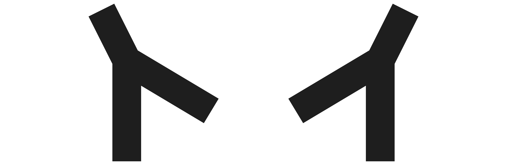

# Lyynix' More Journal Enrichers
This is a module for FoundryVTT.\
FoundryVTTs text editor natively supports the enricher `@UUID`, which is extended by enrichers like `@Scene`, `@Actor`, ...\
All of those have the same functionality: *Click to open/edit*

With More Journal Enrichers you can use similar commands to show game elements in a more usable way. 

A list of all added enrichers can be found under [Usage & Features](#usage--features).

## Installation
You can simply use the install module screen within the FoundryVTT setup.\
Or you can paste the manifest URL in said window:\
!! Paste manifest URL of recent release !!

## Usage & Features
To use any of the enrichers, write or paste the enricher into the text editor of FoundryVTT and fill in the missing elements.

Every enricher in the following list has a link to the corresponding wiki page, where its functionality and possible restrictions are explained.

- `@SceneMenu[sceneID1 sceneID2 ...]` [wiki page](https://github.com/Lyynix/MoreJournalEnrichers/wiki/Enricher_SceneMenu):\
  This enricher adds a list of scenes to the journal, along with buttons to view, activate, edit and toggle the scene in the nav bar
- `@ToC` und `@ToC[journalID]` [wiki page](https://github.com/Lyynix/MoreJournalEnrichers/wiki/Enricher_ToC):\
  This enricher adds an interactive table of contents to the journal page.

### System dependent modules
- `@Character[actorID]` [wiki page](https://github.com/Lyynix/MoreJournalEnrichers/wiki/Enricher_Character):\
  This enricher adds a summary of a charactersheet
  **Systems:** `dnd5e`

## Contact & Support
You need help with the module or you want to share an idea for another enricher i didn't think of?\
Contact me on discord (lyyinx, formerly Lyynix#7777) or create an issue in this repository.

You can also join our Map-Making oriented [Discord Server](https://discord.gg/3fA4VGQeup). It is a german Server, but most members are able and happy to speak in english if you have something to talk about.
Also you can ping me anytime at the official (and english) [Foundry VTT Discord Server](https://discord.gg/foundryvtt).

There also is a discord server oriented themed on map making and FoundryVTT, where im really active.\
This is a german discord server, but most users will speak in english if you have questions or want to talk about something else.